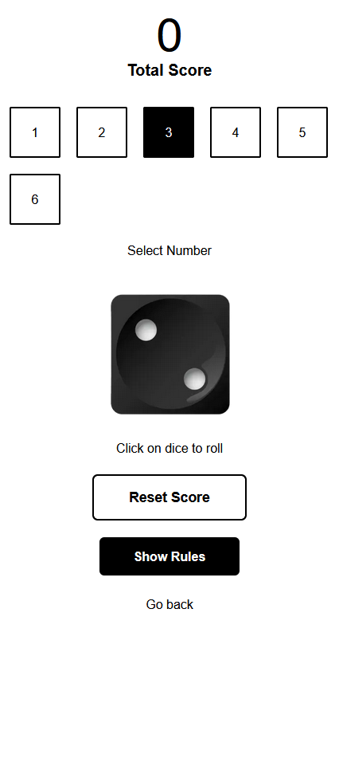

# 🎲 Dice Game App

A fun and interactive **Dice Game** built with **Next.js** and **Framer Motion**. Test your luck and prediction skills by guessing dice outcomes and accumulating points.

---

## Preview

### Desktop

<p align="center" >
  
  
</p>

### Mobile

<p align="center">
  
  
</p>

---

## 🖥️ Features

- **Interactive UI** with smooth animations powered by **Framer Motion**
- **Simple gameplay mechanics** that are easy to understand and play
- **Score tracking** to maximize your points
- **Responsive design** for desktop and mobile

---

## 🎮 How to Play

1. **Select Your Number:**

   - Choose a number between 1 and 6. This is your guess for the upcoming dice roll.

2. **Roll the Dice:**

   - Click on the dice image. The dice will randomly show a number between 1 and 6.

3. **Check the Outcome:**

   - **If your guess matches the dice number:**
     - You earn points equal to the number rolled.  
       _Example:_ Guess 4, dice rolls 4 → +4 points
   - **If your guess does not match:**
     - 2 points are deducted from your score

4. **Game Objective:**

   - Try to maximize your total score by correctly predicting the dice outcome
   - Each round offers a chance to gain or lose points based on your guess

5. **Continue Playing or Stop:**
   - Play multiple rounds to increase your score
   - Decide when you’re done and check your final score

---

## 🛠️ Tech Stack

- **Next.js** – Frontend framework for React applications
- **Framer Motion** – For smooth, interactive animations
- **React** – Component-based UI design
- **Tailwind** – Styling and responsive layouts

---

## 🚀 Getting Started

#### Clone the repo:

```
https://github.com/sizan14789/Dice-Game.git
```

#### install dependencies
```
npm i
```

#### Run
```
npm run dev
```
